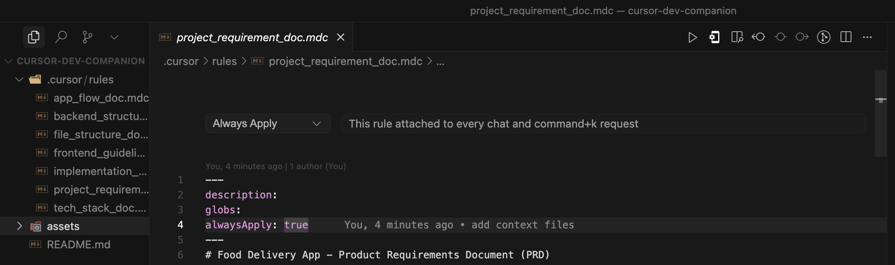

# Documentation des Règles Cursor

Ce répertoire `.cursor/rules` contient des documents de spécification importants qui guident le développement de l'application de livraison de nourriture. Ces fichiers sont au format `.mdc` (Markdown with Cursor-specific metadata) et sont utilisés par Cursor pour comprendre le contexte du projet et aider à la programmation.

## Fichiers de Règles Cursor

Voici la description de chaque fichier `.mdc` dans ce répertoire :

- **`app_flow_doc.mdc`** : Ce document décrit les flux utilisateur typiques au sein de l'application de livraison de nourriture, incluant l'intégration, l'authentification, le processus de commande, le suivi après commande et la gestion du profil/des adresses.
- **`backend_structure_doc.mdc`** : Ce fichier détaille le schéma de la base de données (Postgres), les règles de sécurité au niveau des lignes (RLS) et la configuration du stockage au sein de Supabase pour l'application.
- **`file_structure_doc.mdc`** : Ce document propose une structure de fichiers pour le projet Flutter, adhérant aux principes Clean Architecture et utilisant le modèle BloC pour la gestion de l'état.
- **`frontend_guidelines_doc.mdc`** : Ce document, également appelé "Design System", décrit les directives de conception visuelle de base pour l'application afin d'assurer la cohérence de l'interface utilisateur, y compris les couleurs, la typographie, l'espacement et les composants.
- **`implementation_plan.mdc`** : Ce document décrit les étapes détaillées de mise en œuvre, tâche par tâche, pour l'application de livraison de nourriture, organisées par fonctionnalité (par exemple, Authentification, Gestion du profil, Navigation des restaurants, etc.).
- **`project_requirement_doc.mdc`** : Ce document, le "Product Requirements Document (PRD)", présente les exigences du produit pour l'application mobile de livraison de nourriture, y compris les objectifs, le public cible, les fonctionnalités et les exigences non fonctionnelles.
- **`tech_stack_doc.mdc`** : Ce fichier détaille la pile technologique et la manière dont les différents composants et API interagissent au sein de l'application de livraison de nourriture, couvrant le frontend (Flutter), le backend (Supabase) et la passerelle de paiement (CinetPay).

## Structure des Fichiers `.mdc` et Paramètres Cursor

Les fichiers `.mdc` sont des fichiers Markdown enrichis de métadonnées spécifiques à Cursor au début du fichier. Ces métadonnées sont définies entre des lignes `---` et incluent des paramètres comme `description`, `globs` et `alwaysApply`.

- **`description`** : Une brève description du contenu du fichier.
- **`globs`** : Spécifie un tableau de modèles de fichiers (globs) auxquels cette règle s'applique. Par exemple, `["lib/**/*.dart"]` signifierait que les directives de ce document s'appliquent aux fichiers `.dart` dans le répertoire `lib`. Si laissé vide, la règle peut s'appliquer de manière plus générale ou dépendre d'autres facteurs.
- **`alwaysApply`** : Un booléen qui indique si la règle doit toujours être appliquée, quels que soient les fichiers actifs ou la portée de la tâche en cours. Si `true`, cela signifie que le contenu du document est fondamental et doit toujours être pris en compte par Cursor.

Ces paramètres aident Cursor à contextualiser et à appliquer les règles de manière appropriée pendant le développement.

## Différence entre les fichiers `.md` et `.mdc`

Un fichier `.md` (Markdown) est un format de fichier de texte brut pour l'écriture de documents formatés en utilisant une syntaxe de texte brut. Il est largement utilisé pour la documentation, les `README.md` de projets et les blogs. Un fichier `.mdc`, en revanche, est un format spécifique à Cursor qui étend le Markdown avec un bloc de métadonnées YAML au début du fichier. Ce bloc de métadonnées permet de définir des propriétés spécifiques, comme la `description`, les `globs` et `alwaysApply`, qui aident Cursor à comprendre la portée et la pertinence du document dans un projet, fournissant ainsi un contexte enrichi pour l'assistant de code.
